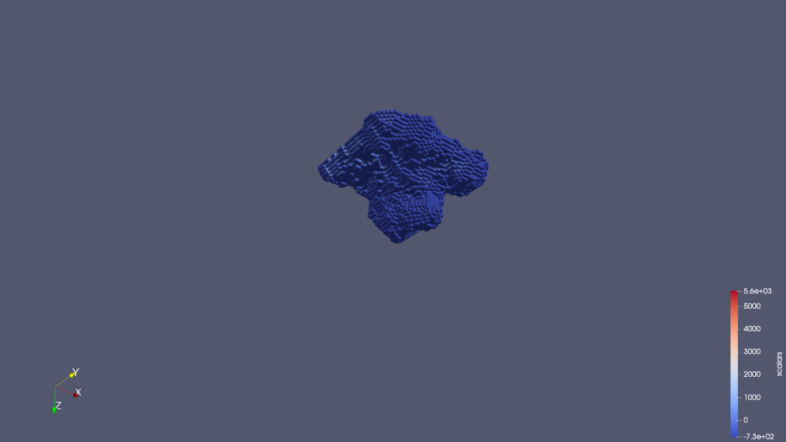
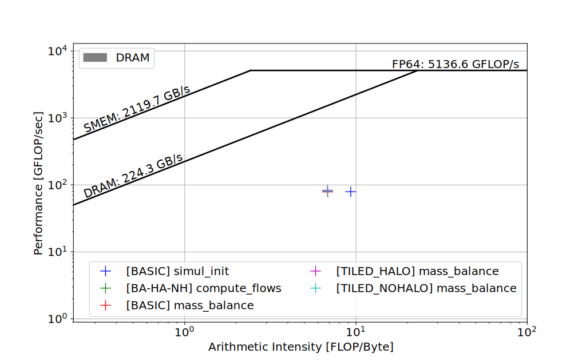
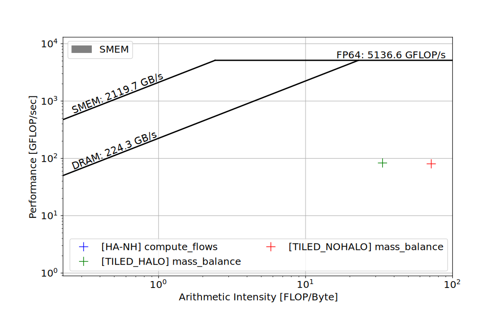
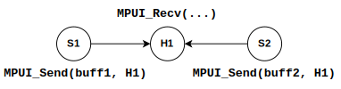
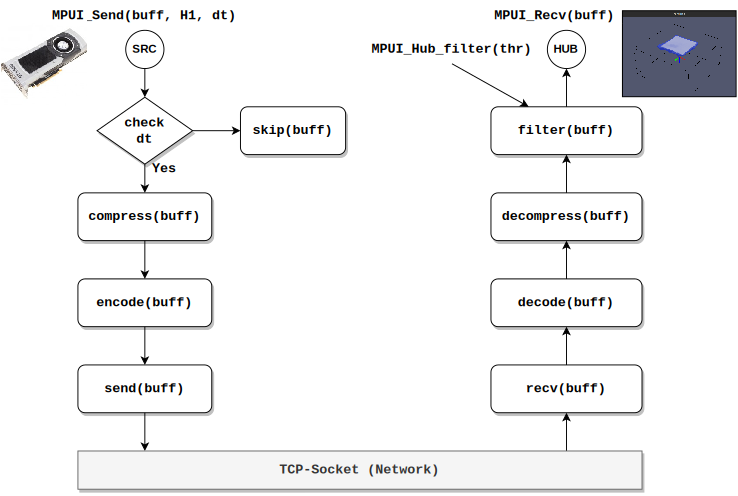
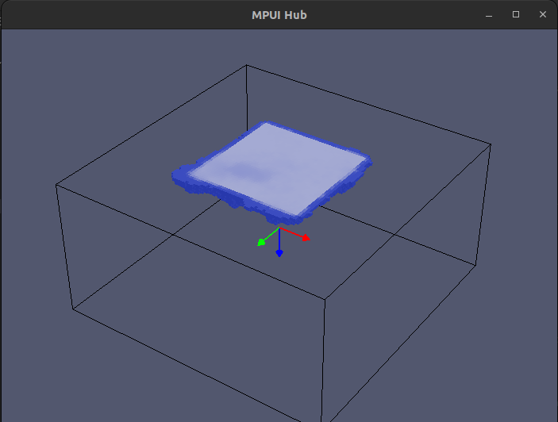

XCA-FLow three-dimensional Cellular Automata
===

The project consists in the multi-GPU parallelization and performance assessment of the XCA-Flow subsurface Extended Cellular Automata model [^1] [^2]. A serial/[OpenMP](https://www.openmp.org/) reference implementation is provided to be used for correctness and performance assessment. A data set, representing the initial configuration of a 10 days long simulation, is also provided.

The project was realized in the context of the *Massively Parallel Programming on GPUs* course during the master's degree in Artificial Intelligence and Computer Science. The project also features the Message-Passing User Interface (MPUI), an MPI-inspired library for interactive visualization.

*   Initial configuration of the three-dimensional domain.
    Colors represent the saturated hydraulic conductivity.
    The domain extends 30 meters long and wide, with a depth of 15 meters, resulting in a grid of 100x100x50 with a cubic cells side of 0.3 meters.
    

*   Simulation result from the initial configuration shown above.
    <table>
        <tr>
            <td></td>
            <td></td>
            <td></td>
        </tr>
    </table>


### Multi-GPU Parallelization

#### Refactoring of Domain Modelling
The entire domain (`Substates` structure) is modelled as a unique linear buffer called `__substates__`, reducing `cudaMalloc` and `cudaMemcpy` calls, and achieving `d__Q` structure locality inside the thread registers (no indirection level of the pointer).
```c++
struct Substates
{
    double ∗__substates__;
    
    double ∗ks;
    
    double ∗teta;
    double ∗teta_next;
    double ∗moist_cont;
    double ∗moist_cont_next ;
    double ∗psi;
    double ∗psi_next;
    double ∗k;
    double ∗k_next;
    double ∗h;
    double ∗h_next;
    double ∗dqdh;
    double ∗dqdh_next;
    double ∗convergence;
    double ∗convergence_next;
    double ∗F;
};
```
```c++
//
// host code
//
double     ∗d__substates__;
Parameters ∗d__P;
// ...
cudaMalloc(&d__substates__, substsize ∗ sizeof(double));
cudaMalloc(&d__P, sizeof(Parameters));
// ...
cudaMemcpy(d__substates__, h__Q.__substates__,
           substsize ∗ sizeof(double), cudaMemcpyHostToDevice);
cudaMemcpy(d__P, &h__P, sizeof(Parameters), cudaMemcpyHostToDevice);

//
// device code (inside a kernel)
//
Substates d__Q;
d__Q.__substates__ = d__substates__;
syncSubstatesPtrs( d__Q, substates_swap );
```

#### Optimize Substate Updates
The copy of the substates `d__Q.sbst = d__Q.sbst_next` has just been replaced with a pointer swap:
*   a swap flag is kept on the host and provided to each kernel;
*   only residual cells (due to `mass_balance` padding) are really copied.
```c++
//
// device code (inside a kernel)
//
Substates d__Q;
d__Q.__substates__ = d__substates__;
syncSubstatesPtrs ( d__Q, substates_swap );
```


#### Substitute Constants with Macros
Where possible, all constant variables are substituted with C macros to reduce registers usage (increasing occupancy), and exploit the computation of constant expressions at compile-time.
```c++
#define ROWS   100
#define COLS   100
#define SLICES  50
// ...
#define P_YOUT (COLS−1)
#define P_YIN 0
#define P_XE (ROWS−1)
#define P_XW 0
#define P_ZSUP (SLICES−1)
#define P_ZFONDO 0
// ...
#define P_h_init 734
#define P_tetas 0.348
#define P_tetar 0.095467
#define P_alfa 0.034733333
#define P_n 1.729
// ...
struct Parameters
{
    double delta_t;
    double delta_t_cum;
    double delta_t_cum_prec;
    double simulation_time;
};
```

#### Kernel (Core) Optimization
The kernel code has been refactored to reduce thread registers usage and minimize thread divergence.
Formulas have been rewritten to reduce floating point operations and reuse previous computations.
Calls of the `pow` function are reduced according to the following remarks:
*   `pow(a, 2)` ⭢ `a * a`;
*   `pow(a, 0.5)` ⭢ `sqrt(a)`;
*   $\bigl( a^b, a^{-b} \bigl) \;= \bigl( a^b, \frac{1}{a^b} \bigl)$, then only one call of `pow(a, b)`;
*   $\bigl( a^{1+b}, a^b \bigl) \;= \bigl( a\cdot a^b, a^b \bigl)$, then only one call of `pow(a, b)`;
*   e.g. $\bigl( 5^{1.729}, 5^{0.729} \bigl) \;= \bigl( 5\cdot 5^{0.729}, 5^{0.729} \bigl)$, then only one call of `pow(5, 0.729)`;
*   e.g. $\bigl( 5^{1.729}, 5^{-0.729} \bigl) \;= \bigl( 5\cdot 5^{0.729}, \frac{1}{5^{0.729}} \bigl)$, then only one call of `pow(5, 0.729)`.


#### Reduction of Memory Copies
During each computation cycle, kernels are invoked reducing the device-host memory copies to a single byte.
```c++
// host code (computation cycle)
reset_flows_kernel      <<< ... >>>( ... );
compute_flows_kernel    <<< ... >>>( ... );
mass_balance_kernel     <<< ... >>>( ... );
update_substates_kernel <<< ... >>>( ... );
substates_swap = !substates_swap; // update substates

reduction_size = __SUBSTATE_SIZE__;
d__reduction_buffer = d__substates__ + ( substates_swap
    ? __Q_convergence_next_OFFSET__
    : __Q_convergence_OFFSET__ );
do
{
    steering_grid_size = ceil(reduction_size / (float)steering_block_size);
    simul_steering<<< ... >>>( ... );

    d__reduction_buffer = d__minvar;
    reduction_size = steering_grid_size;
}
while( steering_grid_size > 1 );

// only 1 byte copy (bool)
cudaMemcpy( &next_step, d__next_step, next_step_size, cudaMemcpyDeviceToHost );
return next_step;
```


#### Usage of CUDA Streams
Because the execution of the `simul_steering` kernel reduces the GPU occupancy over time, the next two kernels (`reset_flows` and `compute_flows`) can be piped into a parallel CUDA stream.
```c++
// host code (computation cycle)
mass_balance_kernel     <<< ... >>>( ... );
update_substates_kernel <<< ... >>>( ... );
substates_swap = !substates_swap; // update substates

cudaDeviceSynchronize();
reset_flows_kernel   <<< ... , pipeStream >>>( ... ); // pipe next two kernels
compute_flows_kernel <<< ... , pipeStream >>>( ... );

reduction_size = __SUBSTATESIZE__;
d__reduction_buffer = d__substates__ + ( substates_swap
    ? __Q_convergence_next_OFFSET__
    : __Q_convergence_OFFSET__ );
do
{
    steering_grid_size = ceil(reduction_size / (float)steering_block_size);
    simul_steering<<< ... >>>( ... );
    
    d__reduction_buffer = d__minvar;
    reduction_size = steering_grid_size;
}
while( steering_grid_size > 1 );

cudaMemcpy( &next_step, d__next_step, next_step_size, cudaMemcpyDeviceToHost );
cudaStreamSynchronize( pipeStream );
```


### Profiling of Kernels

| Kernel          |   FLOP32 |    FLOP64 | FLOP32+64 |
|-----------------|---------:|----------:|----------:|
| `simul_init`    |  4000000 | 522000000 | 526000000 |
| `compute_flows` |        0 |     15678 |     15678 |
| `mass_balance`  | 15289568 | 447431152 | 462720720 |


| Kernel               | DRAM Tran. | DRAM (B) | SMEM Tran. | SMEM (B) |
|----------------------|-----------:|---------:|-----------:|---------:|
| [BA] `simul_init`    |    1761941 | 56382112 |          - |        - |
| [BA] `compute_flows` |     152487 |  4879584 |          - |        - |
| [HA] `compute_flows` |     154473 |  4943136 |     710000 | 22720000 |
| [NH] `compute_flows` |     154468 |  4942976 |     195000 |  6240000 |
| [BA] `mass_balance`  |    2113515 | 67632480 |          - |        - |
| [HA] `mass_balance`  |    2121151 | 67876832 |     433360 | 13867520 |
| [NH] `mass_balance`  |    2118067 | 67778144 |     201950 |  6462400 |


| Kernel               | OR32+64 (DRAM) | OI32+64 (SMEM) | GFLOPS32+64 |
|----------------------|:--------------:|:--------------:|:-----------:|
| [BA] `simul_init`    |      9.329     |        -       |    79.199   |
| [BA] `compute_flows` |       ~ 0      |        -       |    0.0063   |
| [HA] `compute_flows` |       ~ 0      |       ~ 0      |    0.0047   |
| [NH] `compute_flows` |       ~ 0      |       ~ 0      |    0.0057   |
| [BA] `mass_balance`  |      6.842     |        -       |    78.659   |
| [HA] `mass_balance`  |      6.817     |     33.367     |    83.238   |
| [NH] `mass_balance`  |      6.827     |     71.602     |    80.390   |


#### Roofline Model (DRAM)



*   All kernels are **memory-bound** due to the DRAM accesses
*   $\frac{\text{GFLOP}}{\text{sec}} \sim \frac{\text{FLOP}}{\text{Byte}} \sim 0$ for the `compute_flows` kernels


#### Roofline Model (SMEM)



*   `mass_balance` kernels are **compute-bound** w.r.t. the SMEM
*   $\frac{\text{GFLOP}}{\text{sec}} \sim \frac{\text{FLOP}}{\text{Byte}} \sim 0$ for the `compute_flows` kernels


### Speed-Up and Timing
Times are expressed in seconds where TO is used in case of timeout.

*   Simulation Time: 8640
    | Tile Size (xyz) | Basic | Tiled (Halo) | Tiled (No Halo) | MPI-Basic | Serial |      Speed-Up |
    |-----------------|------:|-------------:|----------------:|----------:|-------:|--------------:|
    | 8x8x1           | 0.762 |        0.757 |           0.751 |     0.472 | 21.700 | 28.89 (45.97) |
    | 16x8x4          | 0.810 |        0.804 |           0.804 |         - | 21.700 |         26.99 |
    | 32x8x1          | 0.894 |        0.920 |           0.901 |         - | 21.700 |         24.27 |
    | 32x8x4          | 0.904 |        0.915 |           0.925 |         - | 21.700 |         24.00 |

*   Simulation Time: 43200
    | Tile Size (xyz) | Basic | Tiled (Halo) | Tiled (No Halo) | MPI-Basic | Serial | Speed-Up |
    |-----------------|------:|-------------:|----------------:|----------:|-------:|---------:|
    | 8x8x1           |  3.69 |         3.75 |            3.73 |      2.24 |     TO |        - |
    | 16x8x4          |  3.94 |         3.98 |            3.98 |         - |     TO |        - |
    | 32x8x1          |  4.43 |         4.72 |            4.46 |         - |     TO |        - |
    | 32x8x4          |  5.51 |         4.54 |            4.56 |         - |     TO |        - |

*   Simulation Time: 86400
    | Tile Size (xyz) | Basic | Tiled (Halo) | Tiled (No Halo) | MPI-Basic | Serial | Speed-Up |
    |-----------------|------:|-------------:|----------------:|----------:|-------:|---------:|
    | 8x8x1           |  7.37 |         7.49 |            7.76 |      4.45 |     TO |        - |
    | 16x8x4          |  9.15 |         8.05 |            8.30 |         - |     TO |        - |
    | 32x8x1          |  8.84 |         9.26 |            9.39 |         - |     TO |        - |
    | 32x8x4          |  8.95 |         9.49 |            9.55 |         - |     TO |        - |

*   Simulation Time: 432000
    | Tile Size (xyz) | Basic | Tiled (Halo) | Tiled (No Halo) | MPI-Basic | Serial | Speed-Up |
    |-----------------|------:|-------------:|----------------:|----------:|-------:|---------:|
    | 8x8x1           | 52.15 |        61.15 |           66.62 |     31.43 |     TO |        - |
    | 16x8x4          | 59.56 |        64.97 |           64.94 |         - |     TO |        - |
    | 32x8x1          | 68.38 |        73.05 |           72.83 |         - |     TO |        - |
    | 32x8x4          | 69.76 |        73.78 |           73.45 |         - |     TO |        - |

*   Simulation Time: 864000
    | Tile Size (xyz) |  Basic | Tiled (Halo) | Tiled (No Halo) | MPI-Basic | Serial | Speed-Up |
    |-----------------|-------:|-------------:|----------------:|----------:|-------:|---------:|
    | 8x8x1           | 176.34 |       278.93 |          229.61 |    102.28 |     TO |        - |
    | 16x8x4          | 208.29 |       293.08 |          198.21 |         - |     TO |        - |
    | 32x8x1          | 240.53 |       329.76 |          221.99 |         - |     TO |        - |
    | 32x8x4          | 228.50 |       317.49 |          228.06 |         - |     TO |        - |


### Message-Passing User Interface (MPUI)
MPI-inspired library to interactively visualize the computation of concurrent processes, following a **message-passing** technique in a single program multiple data (SPMD) fashion.

*   **Source** process: dedicated for scientific computation (typically running on a **workstation**)
*   **Hub** process: dedicated for the visualization of data computed by source processes (typically running on a **PC/laptop**)



The source and hub processes communicate through message-passing implemented using **TCP-sockets** (hence even remotely).
The visualization of the hub processes is implemented via the [**OpenGL**](https://www.opengl.org/) library supporting the *3D computational domains*.

#### MPUI Send vs Recv



#### MPUI Header
```c++
//
// mpui.h
//

// ...

enum MPUI_Mode { HUB=0, SOURCE };

struct MPUI_WSize
{
    int x;
    int y;
    int z;
};

struct MPUI_Session
{
    MPUI_Mode    mode;
    MPUI_WSize   wsize;
    std::thread ∗hubloopth;
    
    int sockfd;
    struct sockaddr_in hubaddr;
    unsigned int seqn;

    struct timespec lsend_time;
    bool eof;
};

// ...

void MPUI_Init     ( MPUI_Mode mode, MPUI_WSize wsize, MPUI_Session ∗&session );
void MPUI_Finalize ( MPUI_Session ∗&session );

int  MPUI_Send     ( MPUI_Session ∗session, double ∗buff,
                     const char ∗hostname, unsigned long dt=0 );
int  MPUI_Recv     ( MPUI_Session ∗session, double ∗buff );
void MPUI_Recvlocal( MPUI_Session ∗session, double ∗buff );
bool MPUI_Flag_EOF ( MPUI_Session ∗session );

#ifdef __MPUI_HUB__
void MPUI_Hub_init     ( std::thread ∗&loopth );
void MPUI_Hub_finalize ( std::thread ∗&loopth );
void MPUI_Hub_setWSize ( int xsize, int ysize, int zsize );
void MPUI_Hub_setBuffer( double ∗buff, int xsize, int ysize, int zsize );
void MPUI_Hub_setRange ( double l , double u );
void MPUI_Hub_filter   ( double threshold );
bool MPUI_Hub_onexit   ();
#endif

// ...
```
See the full header file [`mpui.h`](./mpui/mpui.h).

#### MPUI Hub Window



### References

[^1]: D'Ambrosio, Donato, et al. "First SYCL implementation of the three-dimensional subsurface XCA-Flow cellular automaton and performance comparison against CUDA." International Conference on Applied Computing 2022 and WWW/Internet 2022. IADIS, 2022.

[^2]: De Rango, Alessio, et al. "The quantization algorithm impact in hydrological applications: Preliminary results." International Conference on Computational Science. Cham: Springer International Publishing, 2020.